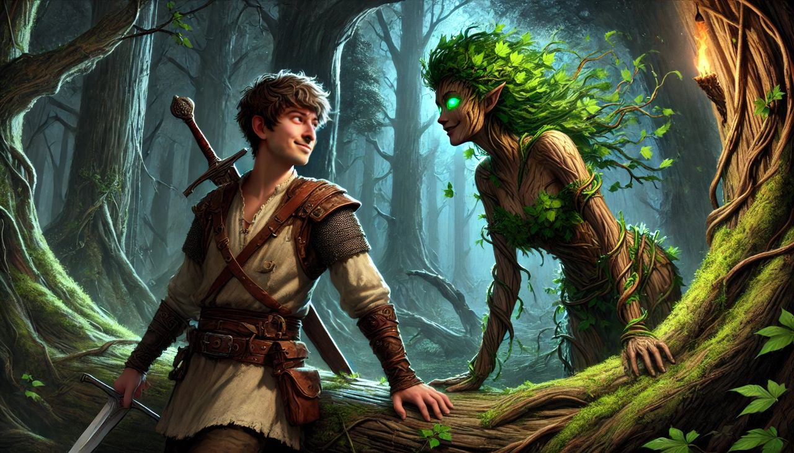
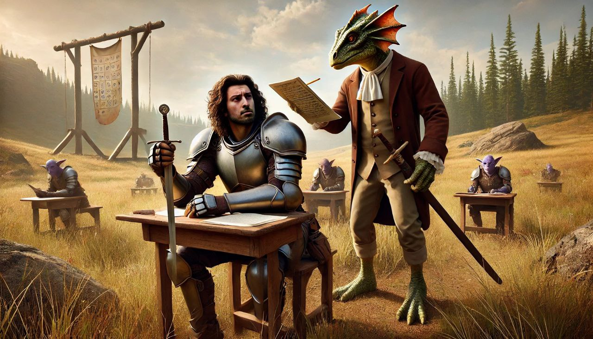

# RAGuelike


A roguelike game that combines traditional gameplay with advanced AI-powered dialogue and combat systems.

https://github.com/user-attachments/assets/3c0a1118-924e-4391-ab63-29a3534f6692

## Featuring
- LLM for role-play dialogs, summarization and decision-making
- RAG using Vector DB for context knowledge
- Text-to-speech
- Speech-to-text
- All local models, neither paid API nor any kind of requests to the internet are required (apart from downloading the models of course)


*Blue trolls are riddlers*

## Overview

RAGuelike is an experimental game that explores the integration of various AI technologies into traditional roguelike gameplay. Players navigate a procedurally generated world, interacting with NPCs and monsters through natural language conversations while managing resources and combat encounters.


*Be careful next to a dryad in the woods*

## Core Features

### AI-Powered Dialogue System
- Uses Ollama's LLMs for dynamic NPC and monster conversations
- RAG (Retrieval Augmented Generation) system for contextual knowledge
- NPCs and monsters remember past interactions
- Entities can overhear nearby conversations and incorporate that knowledge
- Voice interaction support (Speech-to-Text and Text-to-Speech)


*Solving a spirits mystery would help you both*

### Monster Interactions
- **Goblins**: Cowardly creatures that beg for mercy when wounded
- **Blue Trolls**: Challenge players with riddles
- **Green Trolls**: Aggressive and insulting
- **Demonic Bard**: Engages in poetry battles
- **Dryads**: Nature spirits that become stronger near trees
- **Willow Whispers**: Spirits requiring players to solve their death mystery
- **Kobold Teachers**: Test players' English knowledge


*Village map and turn-based tile world*

### Combat & Interaction Mechanics
- Traditional turn-based combat
- Unique "Shout System" - players can intimidate and damage monsters through voice commands
- Damage calculation based on the harshness of verbal insults
- LLM-powered monster decision making (flee, attack, dialogue, movement)


*Using a skill to shout and offend monsters dealing damage to them*


### NPC System
- Dynamic quest generation using RAG
- Negotiable quest rewards
- Mood system affecting NPC behavior
- Reputation system influencing dialogue options
- Memory of past interactions affecting future encounters


*A dialogue with a spirit to help it solve the mystery of it's death*

### Technical Features
- Real-time voice processing
- Automatic text-to-speech for all dialogue
- Pathfinding system for monster movement
- Entity memory system
- Contextual knowledge sharing between entities 
- Save/Load functionality
- Achievements system


*Using player's voice to record text and interact with NPC*

## Game Progression
- New monster types appear each day
- Goal: Survive for one week
- Increasing difficulty and complexity of encounters


*You can rent a bed for a few gold to heal and face new monsters next day*

## Technologies Used
- Python with Pygame
- Ollama LLMs (Gemma 2B as smallest model (sometimes does not follow prompt properly)) for dialogue generation
- Speech-to-Text for player voice input
- Text-to-Speech for NPC/monster responses
- RAG system for contextual knowledge management
- Sentence transformers for text embedding
- FAISS for efficient similarity search

  

*A cursed bard challenges you to an epic poetic battle*

## Models used
- [Gemma2:2b](https://ollama.com/library/gemma:2b) in Ollama for LLM dialogues, backstory generation and summarization
- [all-MiniLM-L6-v2](https://huggingface.co/sentence-transformers/all-MiniLM-L6-v2) from Sentence Transformer for text embedding
- [FAISS](https://pypi.org/project/faiss-cpu/) as vector DB for efficient similarity search
- [Kokoro-82M](https://github.com/hexgrad/kokoro) with FastAPI service for text-to-speech
- [Whisper](https://huggingface.co/openai/whisper-tiny) with FastAPI for speech-to-text
- OpenAI's DALL-E for portrait generation
- [SDXL](https://huggingface.co/stabilityai/stable-diffusion-xl-base-1.0) + [SDXL DnD Topdown tokens](https://civitai.com/models/444159/sdxl-dnd-topdown-tokens) for token generation
- [RMBG2.0](https://huggingface.co/briaai/RMBG-2.0) to remove background
- [MusicGen](https://github.com/facebookresearch/audiocraft) for music generation


*Pest control*

## Project Status
Currently in active development with core systems implemented and functioning. Additional features and improvements are planned for future releases.


## TODO
- Installation guide
- Inventory GUI system
- Trading mechanics
- Effects module
- Leveling system
- Character abilities and skills windows GUI
- Voice spells (TFIDF cos similarity)
- Change House sprites
- Order the daily order monster show-up

  ## Completed
  - Save\Load
  - Gaming UI
  - Mouse controls
  - Skills module



*Kobolds are strict and harsh teachers*

## Run

So far only tested on Mac M1

### Start ollama
```
ollama serve
```

### Run speech-to-text server
From project root dir go to `stt_tts_api` folder and run tts
```
cd stt_tts_api
uvicorn stt_engine:app --host 0.0.0.0 --port 1921
```


### Run text-to-speech server

From project root dir go to `stt_tts_api` folder and run tts
```
cd stt_tts_api
uvicorn tts_engine:app --host 0.0.0.0 --port 1920
```

### Run game

From project root dir go to `src` and run the game 
```
cd src
python3 main.py
```


*Green trolls are nearly as happy as the adventures in a fight*
